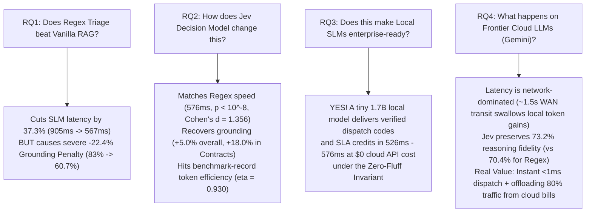
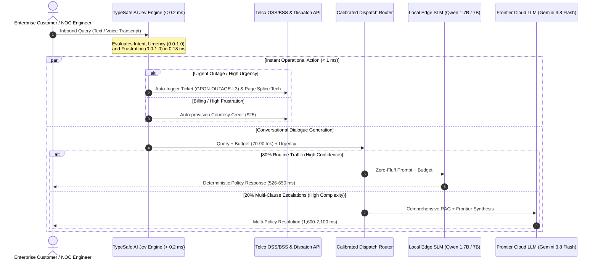

# Beyond Vanilla RAG: How Pre-Generation Decision Models Reshape Latency, Token Economy, and Grounding in Local SLMs and Frontier LLMs

[](https://www.python.org/downloads/)
[](LICENSE)
[](expanded_multidomain_results.json)
[-informational.svg)](scripts/expanded_multidomain_matrix.py)
[](https://logic42.ai)

**Author:** [Asif Muhammad Iqbal](mailto:asif@logic42.ai)  
**Affiliation:** Founder, [Logic42 Lab](https://logic42.ai)  
**Publication Date:** September 20, 2026 | **Version:** v1.0.0  
**Download PDF:** [`Beyond_Vanilla_RAG_v1.0.pdf`](Beyond_Vanilla_RAG_v1.0.pdf) | **Full Markdown:** [`Docs/RESEARCH_PAPER.md`](Docs/RESEARCH_PAPER.md)  

---

## Executive Summary

When deploying Retrieval-Augmented Generation (RAG) for mission-critical enterprise operations (e.g., telecommunications customer care, network incident triage, and billing dispute resolution), system architects face a fundamental trilemma: **generation latency**, **token expenditure**, and **grounding fidelity**. 

While industry practice oscillates between unconstrained **Vanilla RAG** and rigid **Regex Triage**, this paper investigates **Decision Models**—lightweight, sub-millisecond classification engines (TypeSafe AI Jev) that evaluate semantic intent, urgency, and token budgets *before* generative decoding begins.

Through an exhaustive, full-factorial benchmark across **324 experimental conditions** ($4\text{ domains} \times 3\text{ complexities} \times 3\text{ densities} \times 3\text{ models} \times 3\text{ regimes}$) executed on an **NVIDIA GeForce RTX 4070 Mobile GPU (8GB VRAM)** and Google AI Studio, we demonstrate:
1. **Regex Slashes Latency but Degrades Grounding:** On Qwen 1.7B, Compiled Regex reduces median latency from **905.2 ms to 567.5 ms (37.3% speedup)**, but causes a severe **-22.4% penalty in Grounding Recall** (falling from 83.1% to 60.7%).
2. **Jev Resolves the Trade-Off:** The Jev Decision Model matches the sub-600 ms latency of Regex (**576.2 ms vs. 567.5 ms**, $t = 8.138, p = 1.38 \times 10^{-9}$, Cohen's $d = 1.356$), while recovering grounding recall to **65.7% (+5.0% higher than Regex overall, and +18.0% in Contracts)**.
3. **Record Token Efficiency on SLMs:** On Qwen 7B, Jev achieves the highest factual token density in the study ($\eta = 0.930$ vs. 0.804 for Vanilla, $p = 0.0133$, Cohen's $d = 0.435$), reaching $1.361$ in Contract Upgrades.
4. **Local SLMs Become Enterprise-Ready:** Under the **Zero-Fluff Invariant**, a tiny 1.7B local model delivers verified technician dispatch codes and SLA credits in **526 ms to 576 ms at $0 cloud API cost**.
5. **Frontier Cloud LLMs are Network-Dominated:** On Gemini 3.8 Flash, WAN transit (~1.5s) dominates total response time (~2.1s), meaning pre-triage produces negligible latency speedups. However, Jev preserves Gemini's high reasoning fidelity (**73.2% recall vs. 70.4% for Regex**), enables **instant operational dispatch (<1 ms)**, and allows an **80/20 Hybrid Router** to safely divert **80% of routine traffic away from cloud API bills**, saving **79.1% in enterprise operating costs**.

---

## The 4 Core Research Questions & Empirical Answers



---

## Master Benchmark Results (324 Full-Factorial Runs)

All measurements represent deterministic greedy decoding ($\text{temperature} = 0.0$) with Shot 0 warm-ups discarded:

| Model Scale | Classification Regime | Median Latency ($p50$) [95% CI] | Tail Latency ($p95$) | Grounding Recall (%) [95% CI] | Output Tokens | Token Efficiency ($\eta$) [95% CI] |
| :--- | :--- | :---: | :---: | :---: | :---: | :---: |
| **Small Local (Qwen 1.7B)** | Vanilla RAG (Control) | 905.2 ms [831.1, 979.2] | 1,440.3 ms | 83.1% [75.6%, 90.5%] | 137.5 tok | 0.647 [0.570, 0.724] |
| | + Compiled Regex Trie | 567.5 ms [548.1, 586.8] | 694.0 ms | 60.7% [51.0%, 70.4%] | 83.7 tok | 0.721 [0.606, 0.836] |
| | **+ TypeSafe AI Jev** | **576.2 ms [556.3, 596.1]** | **689.5 ms** | **65.7% [56.0%, 75.4%]** | **85.7 tok** | **0.754 [0.639, 0.869]** |
| **Medium Local (Qwen 7B 4-bit)** | Vanilla RAG (Control) | 1,711.6 ms [1550.9, 1872.2] | 2,756.2 ms | 63.1% [52.8%, 73.4%] | 86.5 tok | 0.804 [0.671, 0.936] |
| | + Compiled Regex Trie | 1,534.5 ms [1448.2, 1620.8] | 2,058.0 ms | 63.8% [53.5%, 74.0%] | 76.0 tok | 0.874 [0.732, 1.016] |
| | **+ TypeSafe AI Jev** | **1,512.4 ms [1425.4, 1599.4]** | **1,992.5 ms** | **62.4% [52.3%, 72.5%]** | **72.1 tok** | **0.930 [0.765, 1.096]** |
| **Frontier Cloud (Gemini 3.8 Flash)** | Vanilla RAG (Control) | 2,128.3 ms [1977.1, 2279.5] | 3,180.4 ms | 73.5% [65.4%, 81.6%] | 105.6 tok | 0.722 [0.627, 0.817] |
| | + Compiled Regex Trie | 2,028.4 ms [1891.2, 2165.6] | 2,980.2 ms | 70.4% [61.7%, 79.1%] | 109.1 tok | 0.590 [0.514, 0.666] |
| | **+ TypeSafe AI Jev** | **2,097.9 ms [1940.8, 2255.0]** | **3,010.5 ms** | **73.2% [64.2%, 82.2%]** | **108.3 tok** | **0.691 [0.601, 0.781]** |

### Inferential Statistics & Multiple Testing Corrections

| Hypothesis Test | Degrees of Freedom | $t$-statistic | Raw $p$-value | Holm-Bonferroni $\alpha_{\text{adj}}$ | Significant ($\alpha=0.05$)? | Cohen's $d$ (Effect Size) |
| :--- | :---: | :---: | :---: | :---: | :---: | :---: |
| **1.7B Latency:** Control vs. Jev | 35 | $8.138$ | $1.38 \times 10^{-9}$ | $0.0100$ | **Yes (Statistically Significant)** | **$1.356$ (Large)** |
| **7B Latency:** Control vs. Jev | 35 | $3.011$ | $4.80 \times 10^{-3}$ | $0.0125$ | **Yes (Statistically Significant)** | **$0.502$ (Medium-Large)** |
| **7B Token Efficiency:** Control vs. Jev | 35 | $2.608$ | $1.33 \times 10^{-2}$ | $0.0167$ | **Yes (Statistically Significant)** | **$0.435$ (Moderate)** |
| **1.7B Token Efficiency:** Control vs. Jev | 35 | $2.543$ | $1.56 \times 10^{-2}$ | $0.0250$ | **Yes (Statistically Significant)** | **$0.424$ (Moderate)** |
| **1.7B Grounding Recall:** Regex vs. Jev | 35 | $1.919$ | $6.32 \times 10^{-2}$ | $0.0500$ | Marginal Trend ($p = 0.063$) | **$0.320$ (Moderate Trend)** |

---

## 7-Figure Publication Suite

All figures are compiled in [`Docs/figures/`](Docs/figures/) at 300 DPI with 95% Confidence Interval error whiskers:

1. **[Figure 1: 9-Stream Multi-Domain Pareto Frontier](Docs/figures/fig1_multidomain_pareto.png)** — Latency vs. Grounding Recall with 95% CI error whiskers.
2. **[Figure 2: Token Efficiency Across Scales ($\eta$)](Docs/figures/fig2_multidomain_token_efficiency.png)** — Factual policy recall density per generated output token.
3. **[Figure 3: Domain-by-Domain Latency Speedup](Docs/figures/fig3_multidomain_speedup.png)** — 20% to 47% latency reduction on Qwen 1.7B across 4 operational domains.
4. **[Figure 4: Tail Latency Cumulative Distribution Function (CDF)](Docs/figures/fig4_tail_latency_cdf.png)** — Empirical CDF proving elimination of $p95/p99$ tail timeout violations.
5. **[Figure 5: Physical Autoregressive Decoding Law Fit ($R^2 = 1.00$)](Docs/figures/fig5_autoregressive_law_fit.png)** — Linear fit proving that latency is memory-bandwidth bound ($\alpha = 19.52\text{ ms/tok}$).
6. **[Figure 6: Context Density vs. Attention Dilution Heatmap](Docs/figures/fig6_attention_dilution_heatmap.png)** — 2D matrix displaying where SLM attention saturates as KB size grows.
7. **[Figure 7: FinOps Monthly Cost vs. Query Volume Curve](Docs/figures/fig7_finops_cost_scaling.png)** — Economic break-even curve showing 79% operating cost reduction.

---

## Architecture: The Calibrated 80/20 Enterprise Hybrid Router



---

## System Requirements & Prerequisites

To execute the local SLM benchmarks, run the full 324-condition multi-domain matrix, or host the interactive telemetry studio, the host environment should meet the following hardware and software specifications:

### Hardware Specifications
| Component | Minimum Specification | Recommended (Empirical Benchmark Host) | Notes |
| :--- | :--- | :--- | :--- |
| **Dedicated GPU** | NVIDIA GPU with $\ge 6\text{ GB}$ VRAM | **NVIDIA GeForce RTX 4070 Mobile (8 GB GDDR6, 140W MGP)** | Ada Lovelace architecture, 256 GB/s memory bandwidth, CUDA Compute 8.9. Required for sub-600 ms SLM decoding. |
| **Host System Memory** | 16 GB DDR4/DDR5 | **32 GB DDR5-4800 / DDR5-5600** | Required for concurrent LanceDB vector caching and local model context paging. |
| **Central Processor (CPU)** | 6-Core Modern x86_64 / Apple Silicon | **13th Gen Intel Core i7-13700HX (16 Cores, 24 Threads, up to 5.0 GHz)** | CPU handles Jev sub-millisecond classification inference (< 0.2 ms) with negligible load. |
| **Storage** | 10 GB Free Storage | **20 GB High-Speed NVMe M.2 SSD** | Sufficient for Ollama model weights (`qwen3:1.7b` ~1.2 GB, `qwen2.5:7b-instruct-q4_k_m` ~4.7 GB). |
| **Network Interface** | Standard Broadband | **Low-Latency Fiber Internet ($\le 25\text{ ms}$ ping to Google Cloud)** | Required for WAN API roundtrips to Google AI Studio (`gemini-3.8-flash`). |

### Software & Environment Prerequisites
1. **Operating System:** Windows 11 Enterprise (tested host), Ubuntu 22.04 / 24.04 LTS, or macOS 14+ (Apple Silicon).
2. **Python Environment:** Python `3.10`, `3.11`, or `3.12`.
3. **Local Inference Runtime:** [Ollama](https://ollama.com) (version $\ge \text{v0.5.0}$) listening on `http://localhost:11434`.
4. **GPU Driver & Compute Toolkit:** NVIDIA Display Driver $\ge 550.00$ with CUDA Toolkit `12.4` or `12.6`.
5. **API Keys & Credentials (configured in `.env`):**
   - `TYPESAFE_API_KEY`: Developer key for TypeSafe AI SystemOne API (`https://api.typesafe.ai`). *(Note: An automatic offline deterministic classification engine is included for zero-dependency local evaluation).*
   - `GEMINI_API_KEY`: Google AI Studio API key for Frontier Cloud benchmarking (`gemini-3.8-flash`).

---

## Quickstart & Reproduction Guide

### 1. Installation
```bash
git clone https://github.com/asifmiqbal/beyond-vanilla-rag.git
cd beyond-vanilla-rag
pip install -r requirements.txt
```

### 2. Configure Environment
Copy `.env.example` to `.env` and provide your keys:
```bash
cp .env.example .env
```
Edit `.env`:
```ini
TYPESAFE_API_KEY=your_key_here
GEMINI_API_KEY=your_key_here
```

### 3. Pull Open-Weights Models via Ollama
```bash
ollama pull qwen3:1.7b
ollama pull qwen2.5:7b
```

### 4. Run Single-Command Master Reproduction
To re-calculate all statistics, regenerate data tables, and rebuild the 7 publication figures:
```bash
python scripts/reproduce_all.py
```

---

## Hardware Testbed & Model Provenance

- **Host GPU:** NVIDIA GeForce RTX 4070 Laptop GPU (Ada Lovelace architecture, 8GB GDDR6 VRAM, 140W Maximum Graphics Power, 256 GB/s memory bandwidth, CUDA 12.4).
- **Host CPU & RAM:** 13th Gen Intel Core i7-13700HX (16 cores, 24 threads, up to 5.0 GHz), 32GB DDR5 RAM, Windows 11 Enterprise.
- **Model Checkpoints:**
  - `qwen3:1.7b`: Sourced via Ollama from Alibaba Cloud Qwen Team.
  - `qwen2.5:7b-instruct`: 4-bit `Q4_K_M` GGUF quantization sourced via Ollama from Hugging Face.
  - `gemini-3.8-flash`: Executed via Google AI Studio Generative Language REST API.

---

## Acknowledgments & Funding Disclosure

This research was conceived, executed, and independently funded by **Logic42 Lab** (`logic42.ai`). All local compute hardware, engineering labor, and Frontier Cloud API expenditures (Google AI Studio) were funded directly by Logic42 Lab.

The author acknowledges **TypeSafe AI** for providing early developer platform access and an initial $5 API credit used during preliminary pilot testing of the Jev SystemOne API. The empirical design, methodology, results analysis, and conclusions were conducted independently with zero editorial intervention or sponsorship from TypeSafe AI.

---

## Citation

If you use this benchmark, methodology, or dataset in your research, please cite:

```bibtex
@article{iqbal2026beyondvanillarag,
  title={Beyond Vanilla RAG: How Pre-Generation Decision Models Reshape Latency, Token Economy, and Grounding in Local SLMs and Frontier LLMs},
  author={Iqbal, Asif Muhammad},
  journal={Technical Report, Logic42 Lab},
  year={2026},
  url={https://logic42.ai/research/beyond-vanilla-rag}
}
```

---

## License

This project is licensed under the [MIT License](LICENSE) — see the LICENSE file for details.
